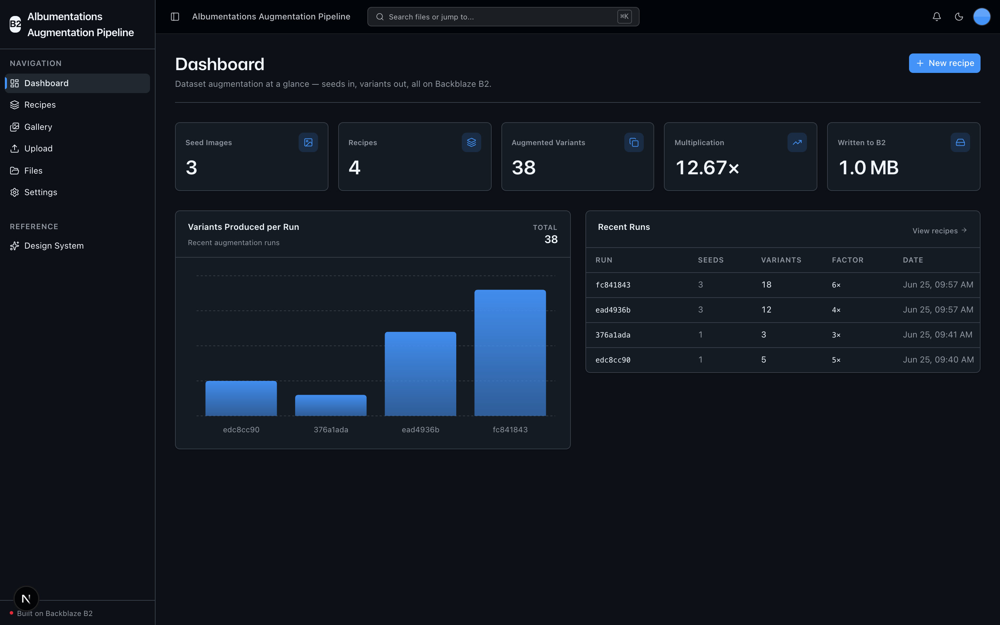
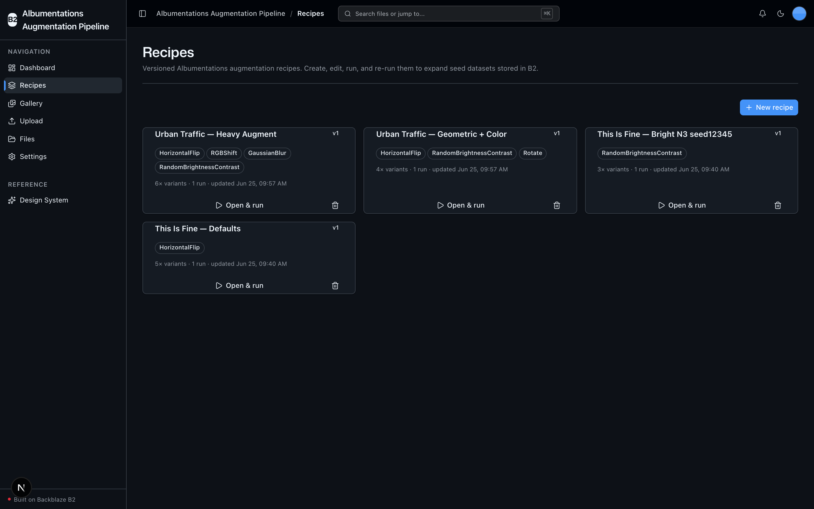
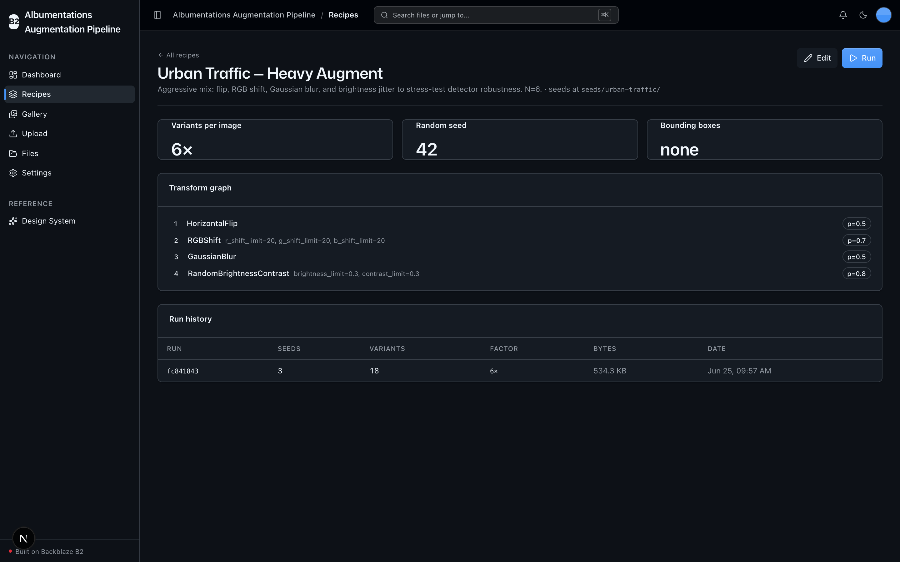
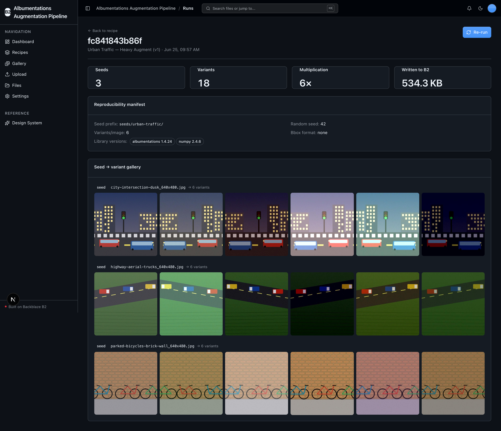
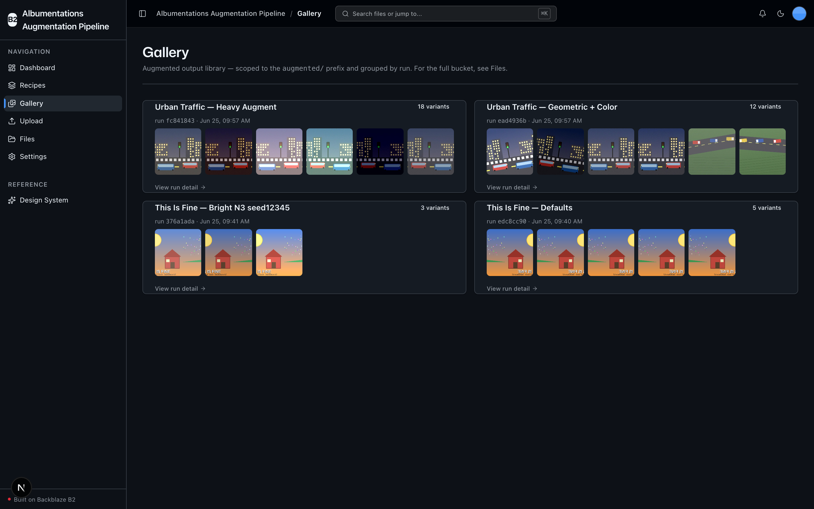

<!-- last_verified: 2026-06-24 -->
# Albumentations Augmentation Pipeline

A reproducible, version-controlled **image dataset augmentation pipeline** on **[Backblaze B2](https://www.backblaze.com/sign-up/ai-cloud-storage?utm_source=github&utm_medium=referral&utm_campaign=ai_artifacts&utm_content=b2ai-albumentations-dataset-augmentation)**. Point it at a small labeled image dataset stored in B2, define a configurable **[Albumentations](https://albumentations.ai/)** transform graph (a named, versioned *recipe*), and run it to generate **N augmented variants per source image** — multiplying a few hundred seed images into thousands of training-ready examples.

Both the seed dataset and the expanded output live on B2, and every run writes a **manifest** that pins the exact recipe + random seed + source list + library versions, so the augmentation can be reproduced bit-for-bit. The headline is deliberate **write amplification**: 500 seeds × 10 variants = 5,000 images written to B2 in one run.

Augmentation runs entirely on **local OSS** (Albumentations is pure-Python, CPU-only) — **B2 credentials are the only secret. No second API key, no model download, no network call to a provider.**

**What you get out of the box:**
- Recipes — the primary entity, with a full UI lifecycle: **create, read, edit, delete, and run**
- Albumentations augmentation engine — a configurable transform graph, N variants per image, deterministic via a pinned seed
- Reproducible run manifests — every run is replayable; "Re-run" reproduces identical output
- A dashboard that surfaces the **dataset multiplication factor** and bytes written to B2
- A scoped **Gallery** explorer (the expanded dataset, grouped by run, with seed→variant pairing)
- The full-bucket **File browser** and drag-and-drop **Upload** (seed ingest) from the starter kit, kept intact
- FastAPI backend with strict layered architecture and structural tests; agent-optimized docs

## What it looks like

**Dashboard** — augmentation metrics at a glance (seed images, recipes, total variants, dataset multiplication factor, and bytes written to B2), a variants-produced-per-run chart, and a recent-runs table.



**Recipes** — the primary entity: a card per versioned recipe showing its transform graph, variant count, and run count, with create, open, run, and delete from the UI.



**Recipe detail** — a single recipe's config (variants per image, pinned random seed, bbox format), its ordered transform graph with per-transform probabilities, and its run history, plus Edit and Run actions.



**Run detail** — the reproducibility manifest (seed prefix, random seed, library versions) and the seed-to-variant gallery, pairing each source image with the N augmented variants written to B2.



**Gallery** — the augmented output library, scoped to the `augmented/` prefix and grouped by run, with thumbnails linking through to each run's detail.



## How it works

```
seeds/<dataset>/...                                  seed images (uploaded via /upload, browsed via /files)
recipes/<recipe-id>.json                             versioned recipe manifest (transforms + meta)
augmented/<recipe-id>/<run-id>/_run.json             run manifest: recipe snapshot + seed list + seed + versions
augmented/<recipe-id>/<run-id>/__aug<k>.<ext>   the N× augmented variants
augmented/<recipe-id>/<run-id>/__aug<k>.txt     (optional) transformed YOLO/bbox sidecar
```

1. **Ingest** seed images to B2 via the Upload page (or any B2 tool).
2. **Configure** a recipe in the UI: pick Albumentations transforms from a catalog, set per-transform params and probability `p`, choose N variants, a seed prefix, and an optional pinned random seed / bbox format.
3. **Run** the recipe. The backend reads each seed, builds an `A.Compose` once, applies it N times, and writes every variant (plus a transformed bbox sidecar where annotations exist) back to B2 under `augmented/`.
4. **Store** a run manifest pinning everything needed to reproduce the run.
5. **Serve** the expanded dataset from the Gallery and run-detail pages via presigned URLs.

## Architecture (single source of truth)

The repo is optimized for coding agents — **[AGENTS.md](AGENTS.md) is the entry point**. Architecture is enforced mechanically: layering (`types -> config -> repo -> service -> runtime`), import boundaries, a 300-line-per-file cap, and `boto3` containment to the `repo/` layer are all verified by structural tests and lints on every change.

```
AGENTS.md              Single source of truth — layout, invariants, commands, conventions
ARCHITECTURE.md        System layout, layering rules, data flows, B2 object layout
docs/
  features/            recipes, augmentation, gallery, file-upload, file-browser, metadata, dashboard
  app-workflows.md     ingest -> configure -> augment -> store -> serve journey
  dev-workflows.md     Engineering workflows and testing
  SECURITY.md          Security principles
  RELIABILITY.md       Reliability expectations
  exec-plans/          Execution plans and tech debt tracker
```

**The augmentation engine (`services/api/app/service/augment.py`) is pure compute** — it only ever sees numpy arrays and bytes, never B2. All S3 I/O (the S3-compatible API only, never b2-native) lives in `services/api/app/repo/b2_client.py` with a custom user agent set on the client.

## Quick Start

You need: Node.js >= 20, pnpm >= 9, Python >= 3.11, and a free **[Backblaze B2 account](https://www.backblaze.com/sign-up/ai-cloud-storage?utm_source=github&utm_medium=referral&utm_campaign=ai_artifacts&utm_content=b2ai-albumentations-dataset-augmentation)**.

### Setup

**1. Install dependencies**

```bash
pnpm install
```

**2. Set up the backend** (installs Albumentations + numpy + boto3)

```bash
cd services/api
python -m venv .venv && source .venv/bin/activate
pip install -r requirements.txt
cd ../..
```

**3. Add your B2 credentials**

```bash
cp .env.example .env
```

Open `.env` in your editor. Then head to the [Backblaze B2 dashboard](https://secure.backblaze.com/b2_buckets.htm?utm_source=github&utm_medium=referral&utm_campaign=ai_artifacts&utm_content=b2ai-albumentations-dataset-augmentation) and:

1. **Create a bucket.** Paste the values into `.env`:
   - **Bucket Unique Name** → `B2_BUCKET_NAME`
   - The region segment of the bucket **Endpoint** (e.g. `us-west-004`) → `B2_REGION` *(the app derives the full S3 endpoint `https://s3.{B2_REGION}.backblazeb2.com` — never hardcode it)*
2. **Create an application key** with `Read and Write` permission. Paste the values into `.env`:
   - **keyID** → `B2_APPLICATION_KEY_ID`
   - **applicationKey** → `B2_APPLICATION_KEY` *(only shown once — paste it now)*

`B2_PUBLIC_URL_BASE` is optional — leave it blank to serve everything via short-lived presigned URLs.

> Walkthroughs: [creating a bucket](https://www.backblaze.com/docs/cloud-storage-create-and-manage-buckets?utm_source=github&utm_medium=referral&utm_campaign=ai_artifacts&utm_content=b2ai-albumentations-dataset-augmentation) and [creating app keys](https://www.backblaze.com/docs/cloud-storage-create-and-manage-app-keys?utm_source=github&utm_medium=referral&utm_campaign=ai_artifacts&utm_content=b2ai-albumentations-dataset-augmentation).

**4. Run it**

```bash
pnpm dev
```

Frontend at `localhost:3000`, API at `localhost:8000`. Upload a few seed images, create a recipe, and hit Run to watch the variants land in B2.

`pnpm dev` runs `pnpm doctor` first — a preflight check that catches the common setup gotchas (wrong Node/Python version, missing venv, missing or placeholder `.env`, ports already taken).

## Using it

1. **Upload** seed images (`/upload`). They land under `uploads/`; you can also stage them anywhere under your chosen seed prefix.
2. **Recipes** (`/recipes`) — create a recipe (name, transforms with params + `p`, N variants, seed prefix, optional random seed, optional bbox format). Open a recipe to edit, delete, or **Run** it.
3. **Run detail** (`/runs/{recipeId}/{runId}`) — the seed→variant gallery, run stats, the full reproducibility manifest, and a **Re-run** button.
4. **Gallery** (`/gallery`) — the augmented output library, scoped to the `augmented/` prefix and grouped by run.
5. **Files** (`/files`) — the full-bucket explorer (seeds, recipes, and augmented output alike).

> **Demo bound:** a single synchronous run augments up to `max_run_source_images` seeds (default 50, set in `config/settings.py`). The UI tells you when a source list was capped — it is never silently truncated.

## Core Features

- [Recipes](docs/features/recipes.md) — the primary entity; full CRUD + run from the UI
- [Augmentation engine](docs/features/augmentation.md) — Albumentations transform graph, N variants, deterministic seeding, reproducible manifests
- [Gallery](docs/features/gallery.md) — scoped `augmented/` explorer with seed→variant pairing
- [File Upload](docs/features/file-upload.md) — drag-and-drop seed ingest
- [File Browser](docs/features/file-browser.md) — full-bucket list, preview, download, delete
- [Dashboard](docs/features/dashboard.md) — augmentation metrics + variants-per-run chart
- [Metadata Extraction](docs/features/metadata-extraction.md) — image dimensions, EXIF, checksums
- [Design System](docs/design-system.md) — tokens, primitives, error/empty patterns. Live at `/design`.

## Tech Stack

- TypeScript, Next.js 16, React 19, Tailwind v4, shadcn/ui, Recharts
- TanStack Query — caching, dedup, retry for every fetch
- Python 3.11+, FastAPI, **Albumentations** + **numpy** (augmentation engine), boto3, Pydantic v2, Pillow
- Backblaze B2 (S3-compatible object storage)
- pnpm workspaces (monorepo)

## Commands

| Command | What it does |
|---------|-------------|
| `pnpm dev` | Start frontend + backend |
| `pnpm dev:web` | Frontend only |
| `pnpm dev:api` | Backend only |
| `pnpm build` | Build frontend |
| `pnpm lint` | Lint frontend |
| `pnpm lint:api` | Lint backend (ruff) |
| `pnpm test:api` | Run backend tests (incl. the no-network augmentation test) |
| `pnpm check:structure` | Verify layering rules |
| `pnpm test:e2e` | Playwright e2e tests (run `pnpm --filter @albumentations-dataset-augmentation/web exec playwright install chromium` once first) |

## Documentation Map

| Doc | Purpose |
|-----|---------|
| [AGENTS.md](AGENTS.md) | Agent table of contents — start here |
| [ARCHITECTURE.md](ARCHITECTURE.md) | System layout, layering, data flows, B2 object layout |
| [docs/features/](docs/features/) | Feature docs (recipes, augmentation, gallery, upload, browser, dashboard, metadata) |
| [docs/app-workflows.md](docs/app-workflows.md) | The ingest → configure → augment → store → serve journey |
| [docs/dev-workflows.md](docs/dev-workflows.md) | Engineering workflows and testing |
| [docs/SECURITY.md](docs/SECURITY.md) | Security principles |
| [docs/RELIABILITY.md](docs/RELIABILITY.md) | Reliability expectations |
| [docs/exec-plans/](docs/exec-plans/) | Execution plans and tech debt tracker |

## License

MIT License - see [LICENSE](LICENSE) for details.

## Claude Agent B2 Skill

Manage Backblaze B2 from your terminal using natural language (list/search, audits, stale or large file detection, security checks, safe cleanup).

Repo: [https://github.com/backblaze-b2-samples/claude-skill-b2-cloud-storage](https://github.com/backblaze-b2-samples/claude-skill-b2-cloud-storage)
